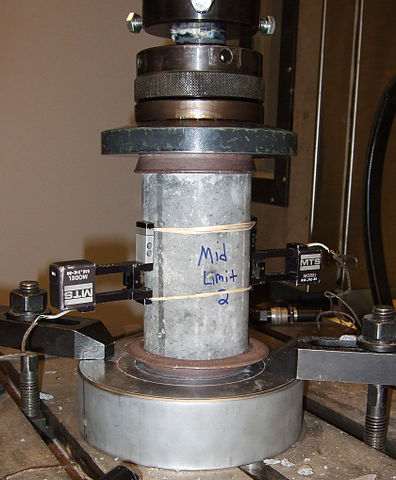

## Concrete is the most important material in civil engineering 

- Compression strength of concrete is highly non-linear function of age and ingredients
- Testing of concrete requires heavy equippment & machinery
 
<small>Source: Wikipedia</small>

--- .class #id 

## How can this app help?

- This calculator predicts compressive strenght from the age and ingredients of concrete 
- Simple equipment needed (browser)
- User friendly interface
- 100% Open source

--- .class #id 

## State-of-the art statistical technique

- R's Support Vector Machines algortihm has been used to fit a non-linear model
- Trained on a data set of 1030 real concrete examples
- Reliabilty of 93%: tested with statistically proven techniques

--- .class #id 

## Interested?

- Visit us at https://zsepsey.shinyapps.io/proj
- Look at the source code at the Git repository:  
https://github.com/zsepsey/datasciencecoursera/tree/master/Data%20Products
- Look at the data set of examples:  
https://archive.ics.uci.edu/ml/datasets/Concrete+Compressive+Strength

